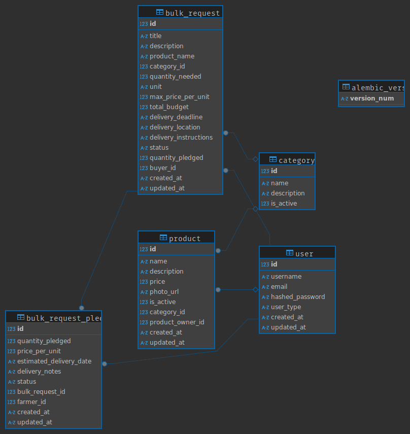

# Project Report

- **Student Name: Hasidul Islam (20054905)**
- **Programme: Master of Science (MSc) Information Systems with Computing**

- **Lecturer Name: Paul Laird**
- **Module/Subject Title: PROGRAMMING FOR INFORMATION SYSTEMS**
- **Assignment Title:CA2 Project for PROGRAMMING FOR INFORMATION SYSTEMS**

## Company Description

CrowdFarming is a European platform that connects consumers directly with organic farmers, enabling them to buy seasonal produce or adopt trees and animals to receive their harvests. It eliminates intermediaries, allowing farmers to set fair prices while reducing food waste and environmental impact. The platform supports farmers with logistics, packaging, and customer service, promoting sustainable and transparent agriculture across Europe.

## My Project Idea

In my project, I want to create a platform where farmers can list their products for sale and general consumers can buy directly from the farmers. An additional feature will be that Other businesses and small stores can also post for their needs, and the platform will gather products from multiple farmers to serve the business's larger needs.

## Company Website

https://www.crowdfarming.com/en

## Google Maps link to the company

https://maps.app.goo.gl/gTwiezcw1yAh9WTx9

## Features

### User Roles

1. Farmer: Can create an account and list products.

2. Consumer: Can browse and purchase available products.

3. Business Buyer: Can post bulk product requests.

### Farmer Features

- Register/Login
- Create product listings with:

  - Product name
  - Price per unit
  - Available quantity
  - Product photo
  - Description
  - Category

- View and manage listed products
- Mark items as "Active" or "Inactive"
- See public bulk request list
- See the bulk request list they are serving
- Pledge to fulfill a bulk request
  - Quantity pledged
  - Price per unit
  - Estimated delivery date
  - Delivery notes
- View the status of their pledges
- Cancel a pledge

### Consumer Features

- Register/Login
- Browse available products by category (e.g., fruits, vegetables)
- View farmer profiles
- Add items to cart and place a basic order
- View order confirmation

### Business Buyer Features

- Register/Login
- Post a “Bulk Request” (e.g., 100kg of carrots)
  - Product needed
  - Quantity
  - Delivery deadline
  - Delivery location
  - Delivery instructions
  - Total budget
  - Maximum price per unit
- See the list of their requests
  - You can search the requests by title, description, product name, category, status, quantity, price, and delivery deadline
  - You can filter the requests by category, status, quantity, price, and delivery deadline
  - You can sort the requests by title, quantity, price, and delivery deadline
  - You can paginate the requests
  - You can view the details of a request
  - You can cancel a request
- View which farmers have pledged to fulfill portions of the request

## Technology Used

### Frontend

- [React](https://reactjs.org/)
- [Vite](https://vitejs.dev/)
- [Material UI](https://mui.com/)
- [Tanstack Router](https://tanstack.com/router/latest)

### Backend

- [FastAPI](https://fastapi.tiangolo.com/)
- [Alembic](https://alembic.sqlalchemy.org/en/latest/)
- [Pydantic](https://docs.pydantic.dev/latest)
- [passlib](https://pypi.org/project/passlib/)
- [SQLAlchemy](https://www.sqlalchemy.org/)

### Testing

For unit testing the backend, I used. The tests of the apps can be found
in the tests.py file in each app folder.

- [Pytest](https://docs.pytest.org/en/6.2.x/contents.html)

## Database Schema

## References

1. [FastAPI](https://fastapi.tiangolo.com/)
2. [complete-react-v9 course on Frontend Masters](https://frontendmasters.com/courses/complete-react-v9/)
3. [complete-react-v9 course helper website](https://react-v9.holt.courses/)
4. [Alembic](https://alembic.sqlalchemy.org/en/latest/)
5. [Pydantic](https://docs.pydantic.dev/latest)
6. [passlib](https://pypi.org/project/passlib/)
7. [Tastack Router](https://tanstack.com/router/latest)
8. [Pytest](https://docs.pytest.org/en/6.2.x/contents.html)
9. [Material UI](https://mui.com/)
10. [Vite](https://vitejs.dev/)
11. [React](https://reactjs.org/)
12. [Node.js](https://nodejs.org/en)
13. [npm](https://www.npmjs.com/)
14. [Python](https://www.python.org/)
15. [JavaScript](https://www.javascript.com/)
16. [Apidog](https://apidog.com/)
17. [SQLAlchemy](https://www.sqlalchemy.org/)
